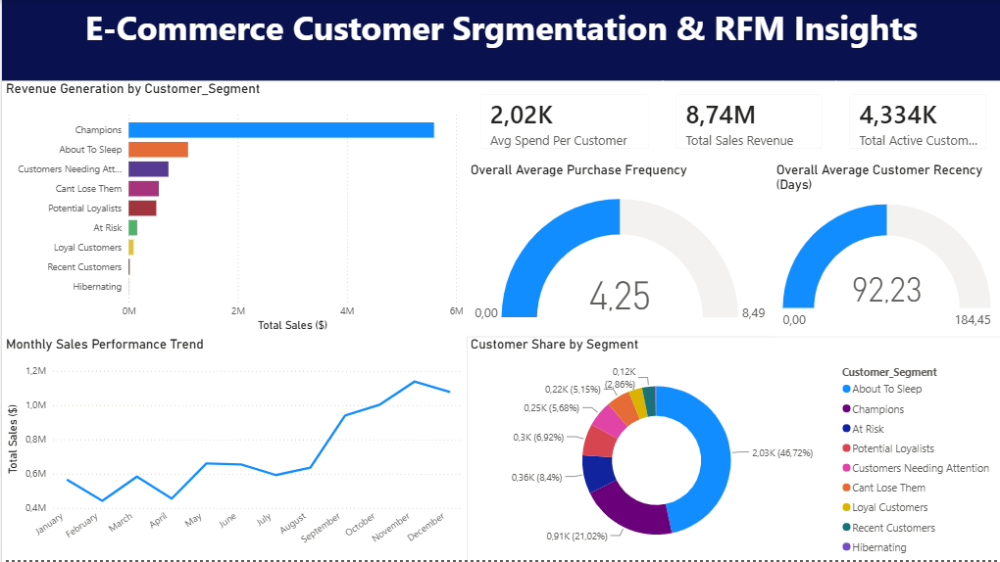

# 🛒 E-Commerce Customer Segmentation & RFM Insights

An end-to-end data analytics project focused on understanding customer purchasing behavior and dividing them into strategic marketing segments using the **RFM (Recency, Frequency, Monetary)** model. 

---

## 💻 Dashboard Preview

*(Note: Please review the attached PDF file `E-Commerce_RFM_Dashboard_Report.pdf` for the full high-quality report).*

---

## 🚀 Project Workflow & Tech Stack

This project was built systematically across three core stages to ensure absolute data transparency and high performance:

### 1️⃣ Data Cleaning & Preparation (Python)
* Processed raw online retail transaction logs.
* Handled over 135,000 missing customer identifications by isolating guest checkouts safely to ensure RFM accuracy.
* Eliminated over 5,000 duplicate records.
* Rectified negative financial entries (returns/cancellations) and established a solid `TotalAmount` column.
* Formatted messy string datetime types into isolated standard date and structural purchase hour features.

### 2️⃣ Statistical Scoring & Segmentation (SQL Server)
* Hosted data safely inside a local Microsoft SQL Server DB.
* Implemented multiple layered **CTEs (Common Table Expressions)** to dynamically aggregate historical data per user.
* Applied advanced **`NTILE(5)` Window Functions** to automatically classify customers into accurate 1-to-5 tiers based on **Recency, Frequency, and Monetary** metrics.
* Developed complex **`CASE WHEN` Conditional Statements** to mathematically map individual 3-digit RFM codes into executive-friendly business segments.

### 3️⃣ Executive Dashboard & Visual Engineering (Power BI)
* Created a highly scalable data model utilizing strategic Cross-Filtering relationships.
* Formulated clean, non-cluttered visuals tracking overall store health.
* Engineered comparative Horizontal Bar charts, dynamic Donut segment distributions, continuous Line performance trends, and precise Key Performance Indicator (KPI) Gauge counters.

---

## 🎯 Marketing Action Plan (RFM-Driven Strategies)

Based on the dashboard insights, here is the strategic action plan tailored for each customer segment to maximize retention and advertising ROI:

### 🏆 1. Champions
* **Characteristics:** Recent buyers, purchase frequently, and spend the most.
* **Action Plan:** Reward them with exclusive VIP loyalty programs. Offer early access to new product launches. Focus on personalized cross-selling and up-selling strategies.

### 💤 2. About To Sleep
* **Characteristics:** Below-average recency and frequency values. Safe but losing interest.
* **Action Plan:** Send personalized "We Miss You" email campaigns. Provide limited-time reactivation coupons or free shipping triggers. Recommend popular products based on past purchase history.

### ⚠️ 3. At Risk
* **Characteristics:** Spent big money and purchased often, but haven't returned in a long time.
* **Action Plan:** Direct reach out via high-value incentives (e.g., 20% off next purchase). Run customer satisfaction surveys to understand why they stopped buying.

### 🐻 4. Hibernating (Lost Customers)
* **Characteristics:** Last purchase was a long time ago, low frequency, and low spenders.
* **Action Plan:** Standard automated re-engagement campaigns. Offer deep-discount clearance items to liquidate old stock. Do not spend heavily on paid ads for this segment.

### ⭐ 5. Potential Loyalists
* **Characteristics:** Recent customers with average frequency, but good spending habits.
* **Action Plan:** Offer multi-tier loyalty milestones to encourage repeat purchases. Recommend complementary products (Upselling).

---

## 📂 Repository Contents
* `1_Data_Cleaning_with_Python.ipynb`: Complete Jupyter Notebook containing raw ETL processes.
* `2_RFM_Analysis_with_SQL.sql`: Structured T-SQL script storing core computation algorithms.
* `E-Commerce_RFM_Dashboard_Report.pdf`: Exported interactive dashboard file for rapid cross-examination.

